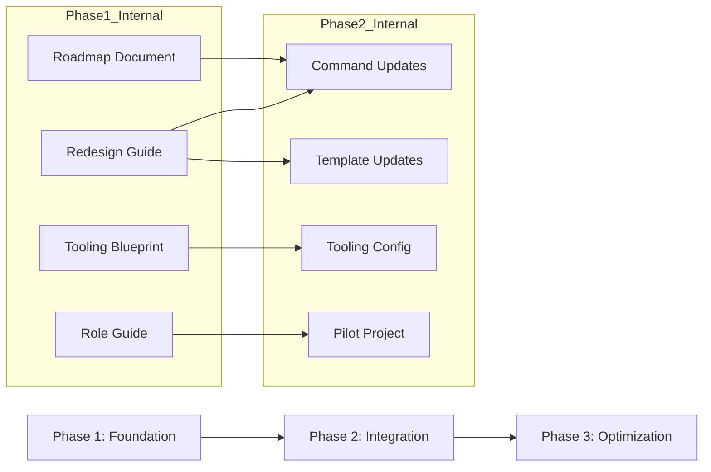

**Document**: IPD Transformation Roadmap
**Part of**: IPD Toolkit Transformation Plan Collection
**Status**: Draft
**Date**: 2026-06-06

# IPD Transformation Roadmap

## Overview & Scope

This roadmap defines a phased transformation of the vibe-ipd SDD (Spec-Driven
Development) toolkit into an IPD (Integrated Product Development) enhanced
toolkit that blends the rigor of IPD stage-gate governance with the flexibility
of Agile delivery.

**Current state (SDD-only)**: 7 commands + 4 templates focused on spec-first
development, with a linear workflow: Constitution → Spec → Clarify → Checklist
→ Plan → Tasks → Analyze → Implement. No formal gate governance or phase
review mechanisms.

**Target state (IPD-enhanced)**: Same command set augmented with TR gate
awareness (TR1–TR6), dual-track Agile discovery/delivery workflow, PDT role
mapping, quality built-in automation, and tooling platform integration. Each
command and template gains gate checkpoints aligned with the Agile-Stage-Gate
hybrid model.

**Scope**: This transformation covers:
1. SDD command adaptation (7 commands gain gate awareness)
2. Template updates (4 templates gain IPD-aligned sections)
3. Tooling platform configuration (Jira/Advanced Roadmaps)
4. Organizational role mapping (PDT structure)

## Phase 1: Foundation

**Entrance Criteria**: Constitution approved (v1.0.0), feature spec agreed,
IPD fusion guide reviewed.

**Exit Criteria**: All 4 transformation plan documents created and reviewed;
command maintainers have clear understanding of required changes.

**Effort Estimate**: Large (4–6 weeks)

### Deliverables

1. **Transformation Roadmap** (this document)
2. **Command & Template Redesign Guide** — detailed before/after specs for
   all commands and templates
3. **Tooling Integration Blueprint** — platform configuration guide
4. **Role Mapping & PDT Setup Guide** — organizational design document
5. Updated Constitution with IPD-Agile principles

### Dependencies

- None — this is the first phase

---

## Phase 2: Integration

**Entrance Criteria**: Phase 1 complete — all plan documents published and
reviewed.

**Exit Criteria**: All 7 SDD commands and 4 templates updated with IPD gate
awareness; CI/CD pipeline enhanced with quality gate automation.

**Effort Estimate**: Large (6–8 weeks)

### Deliverables

1. Updated skill files for all 7 SDD commands with TR gate checkpoints
2. Updated templates (constitution, spec, plan, tasks) with IPD-aligned sections
3. Tooling platform configured with issue hierarchy and gate automation rules
4. Pilot project launched using IPD-enhanced workflow (single feature cycle)
5. Pilot retrospective with lessons learned

### Dependencies

- Phase 1 deliverables (design guides) are prerequisites
- Command updates can proceed in parallel with tooling configuration

---

## Phase 3: Optimization

**Entrance Criteria**: Phase 2 complete — pilot feature cycle delivered;
retrospective findings documented.

**Exit Criteria**: IPD-enhanced toolkit adopted by at least one production
team; CBB reuse metrics collected; gate compliance rate ≥ 90%.

**Effort Estimate**: Medium (4–6 weeks)

### Deliverables

1. Toolkit refinements based on pilot feedback
2. Adoption guide and training materials for new teams
3. CBB (Common Building Block) catalog for shared components
4. WSJF prioritization framework operationalized in backlog
5. Automated gate compliance dashboard

### Dependencies

- Phase 2 pilot findings
- Real team adoption and feedback

---

## Dependency Graph

## Timeline Summary

| Phase | Duration | Effort | Prerequisites |
|-------|----------|--------|---------------|
| Phase 1: Foundation | 4–6 weeks | Large | Constitution, IPD guide |
| Phase 2: Integration | 6–8 weeks | Large | Phase 1 deliverables |
| Phase 3: Optimization | 4–6 weeks | Medium | Phase 2 pilot findings |
| **Total** | **14–20 weeks** | | |

## Cross-References

- [Command & Template Redesign Guide](02-command-template-redesign-guide.md)
  — details of Phase 2 command/template work
- [Tooling Integration Blueprint](03-tooling-integration-blueprint.md)
  — details of Phase 2 tooling work
- [Role Mapping & PDT Setup Guide](04-role-mapping-pdt-setup-guide.md)
  — team structure guidance for Phase 2 pilot

*This roadmap aligns with **Principle III (Agile-Stage-Gate Governance)**
by defining explicit phases with entrance/exit criteria and dependency
management.*
