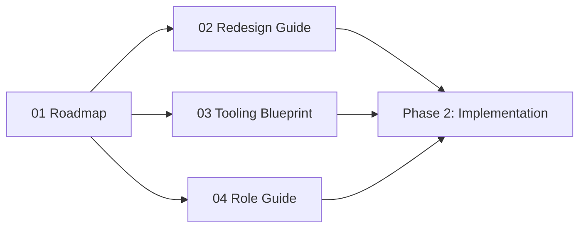

**Document**: IPD Toolkit Transformation Plan — Collection Overview
**Status**: Draft
**Date**: 2026-06-06

# IPD Toolkit Transformation Plan

This collection provides a comprehensive blueprint for evolving the Spec Kit
SDD (Spec-Driven Development) toolkit into an IPD (Integrated Product
Development) enhanced toolkit using the Agile-Stage-Gate hybrid model.

## Documents

Read in order for full context, or jump to a specific guide:

| # | Document | Description | Audience | Priority |
|---|----------|-------------|----------|----------|
| 01 | [Transformation Roadmap](01-transformation-roadmap.md) | Phased plan: Foundation → Integration → Optimization with milestones, dependencies, and effort estimates | Project maintainers, stakeholders | 🎯 Start here |
| 02 | [Command & Template Redesign Guide](02-command-template-redesign-guide.md) | Before/after specifications for all 7 SDD commands and 4 templates with TR gate integration | AI coding agent maintainers | P1 |
| 03 | [Tooling Integration Blueprint](03-tooling-integration-blueprint.md) | Jira Cloud/Advanced Roadmaps configuration for Agile-Stage-Gate workflow enforcement | Platform engineers | P2 |
| 04 | [Role Mapping & PDT Setup Guide](04-role-mapping-pdt-setup-guide.md) | IPD-to-Agile role mapping, Product Trio definition, RACI matrix, and team sizing guidance | PDT managers, team leads | P2 |

## Supporting Files

| File | Description |
|------|-------------|
| [Glossary](glossary.md) | Canonical definitions of all IPD, Agile, and SDD terms |
| [CONTRIBUTING.md](CONTRIBUTING.md) | Document formatting conventions and cross-reference syntax |

## Quick Start

```text
1. Read the Roadmap (01) → Understand full scope and phases
2. Read the Role Guide (04) → Structure your PDT
3. Read the Redesign Guide (02) → Plan command/template updates
4. Read the Blueprint (03) → Configure tooling
5. Implement Phase 2 changes (separate feature cycles)
6. Launch pilot project
```

## Dependency Ordering


