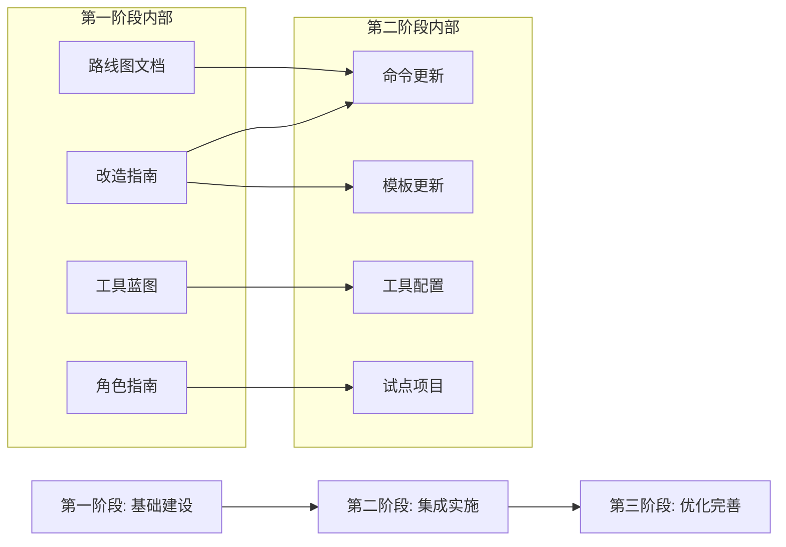

**文档**: IPD转化路线图
**所属合集**: IPD工具包改造计划
**状态**: 草稿
**日期**: 2026-06-06

# IPD转化路线图

## 概述与范围

本路线图定义了vibe-ipd从仅支持规格驱动开发（SDD）到融合IPD（集成产品开发）增强工具包的阶段性改造计划。改造将IPD阶段门径的治理严谨性与敏捷交付的柔性响应能力相结合。

**当前状态（仅SDD）**：7个命令 + 4个模板，聚焦于规格驱动开发，采用线性工作流：宪法 → 规格 → 澄清 → 检查清单 → 计划 → 任务 → 分析 → 实施。没有正式的门径治理或阶段评审机制。

**目标状态（IPD增强）**：相同命令集增加TR门径感知能力（TR1–TR6）、双轨敏捷探索/交付工作流、PDT角色映射、质量内建自动化和工具平台集成。每个命令和模板都将获得与敏捷-门径混合模型对齐的门径检查点。

**改造范围**：
1. SDD命令改造（7个命令增加门径感知）
2. 模板更新（4个模板增加IPD对齐章节）
3. 工具平台配置（Jira/Advanced Roadmaps）
4. 组织角色映射（PDT结构）

## 第一阶段：基础建设

**准入标准**：宪法已批准（v1.0.0）、特性规格已达成共识、IPD融合指南已审阅。

**准出标准**：所有4份改造计划文档已创建并评审；命令维护者清楚了解所需变更。

**工作量估算**：大（4–6周）

### 交付物

1. **转化路线图**（本文档）
2. **命令与模板改造指南** — 所有命令和模板的详细前后对比规格
3. **工具集成蓝图** — 平台配置指南
4. **角色映射与PDT组建指南** — 组织设计文档
5. 更新后的宪法（含IPD-敏捷原则）

### 依赖

- 无 — 这是第一阶段

---

## 第二阶段：集成实施

**准入标准**：第一阶段完成 — 所有计划文档已发布并评审。

**准出标准**：所有7个SDD命令和4个模板已更新为IPD门径感知版本；CI/CD流水线已增强质量门径自动化。

**工作量估算**：大（6–8周）

### 交付物

1. 所有7个SDD命令的更新技能文件（含TR门径检查点）
2. 更新后的模板（宪法、规格、计划、任务）含IPD对齐章节
3. 已配置门径自动化规则的问题层级和工具平台
4. 使用IPD增强工作流启动的试点项目（单功能周期）
5. 包含经验教训的试点回顾

### 依赖

- 第一阶段交付物（设计指南）是前置条件
- 命令更新可与工具配置并行推进

---

## 第三阶段：优化完善

**准入标准**：第二阶段完成 — 试点功能周期已交付；回顾发现已记录。

**准出标准**：IPD增强工具包已被至少一个生产团队采用；CBB复用指标已收集；门径合规率 ≥ 90%。

**工作量估算**：中（4–6周）

### 交付物

1. 基于试点反馈的工具包优化
2. 新团队采用指南和培训材料
3. CBB（公用基础模块）目录
4. WSJF优先级排序框架在待办列表中的运行
5. 自动化门径合规看板

### 依赖

- 第二阶段试点发现
- 真实团队采用和反馈

---

## 依赖关系图

## 时间线汇总

| 阶段 | 周期 | 工作量 | 前置条件 |
|------|------|--------|----------|
| 第一阶段：基础建设 | 4–6周 | 大 | 宪法、IPD指南 |
| 第二阶段：集成实施 | 6–8周 | 大 | 第一阶段交付物 |
| 第三阶段：优化完善 | 4–6周 | 中 | 第二阶段试点发现 |
| **合计** | **14–20周** | | |

## 交叉引用

- [命令与模板改造指南](02-命令与模板改造指南.md) — 第二阶段命令/模板工作详情
- [工具集成蓝图](03-工具集成蓝图.md) — 第二阶段工具工作详情
- [角色映射与PDT组建指南](04-角色映射与PDT组建指南.md) — 第二阶段团队结构指导

*本路线图与**原则III（敏捷-门径治理）**对齐，定义了明确的阶段准入/准出标准和依赖管理。*

---

[英文原文 / English Original](../01-transformation-roadmap.md)