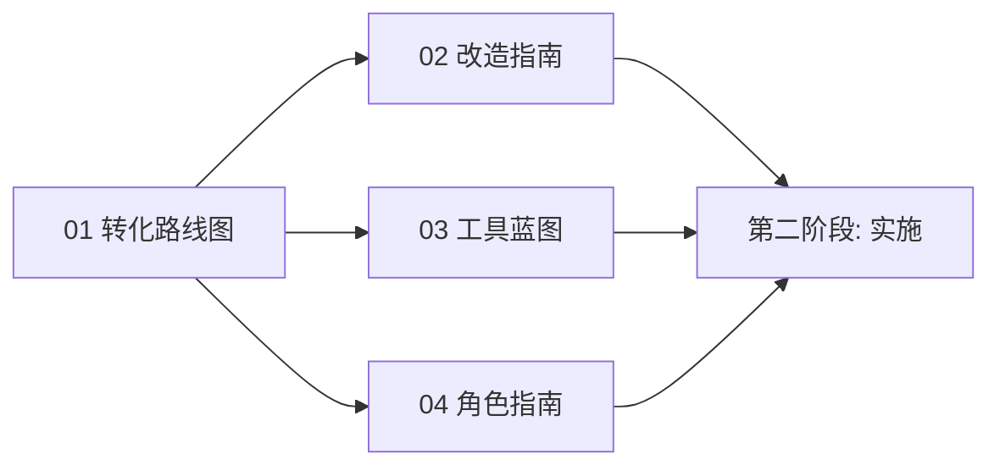

**文档**: IPD工具包改造计划 — 中文合集概览
**状态**: 草稿
**日期**: 2026-06-06

# IPD工具包改造计划

本合集提供将Spec Kit SDD（规格驱动开发）工具包改造为IPD（集成产品开发）增强工具包的全面蓝图，采用敏捷-门径混合模型。

## 文档

按顺序阅读获取完整上下文，或直接跳转到特定指南：

| # | 文档 | 描述 | 读者 | 优先级 |
|---|------|------|------|--------|
| 01 | [转化路线图](01-转化路线图.md) | 阶段性计划：基础建设 → 集成实施 → 优化完善，含里程碑、依赖关系和工作量估算 | 项目维护者、干系人 | 🎯 起点 |
| 02 | [命令与模板改造指南](02-命令与模板改造指南.md) | 全部7个SDD命令和4个模板的前后对比规格，含TR门径集成 | AI编码代理维护者 | P1 |
| 03 | [工具集成蓝图](03-工具集成蓝图.md) | Jira Cloud/Advanced Roadmaps配置，用于敏捷-门径工作流强制执行 | 平台工程师 | P2 |
| 04 | [角色映射与PDT组建指南](04-角色映射与PDT组建指南.md) | IPD到敏捷角色映射、产品三人组定义、RACI矩阵和团队规模指导 | PDT经理、团队负责人 | P2 |

## 支持文件

| 文件 | 描述 |
|------|------|
| [术语表](glossary.md) | IPD、敏捷和SDD术语的规范定义 |
| [格式规范](CONTRIBUTING.md) | 文档格式规范和交叉引用语法 |

## 快速开始

```text
1. 阅读路线图（01）→ 了解全部范围和阶段
2. 阅读角色指南（04）→ 建立PDT结构
3. 阅读改造指南（02）→ 规划命令/模板更新
4. 阅读工具蓝图（03）→ 配置工具平台
5. 实施第二阶段变更（单独的功能周期）
6. 启动试点项目
```

## 依赖顺序



---

[英文原文 / English Original](../README.md)