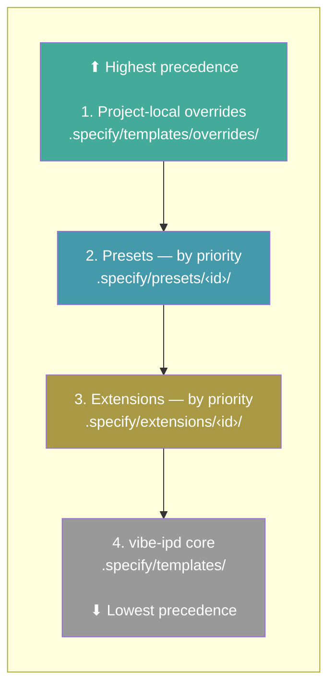
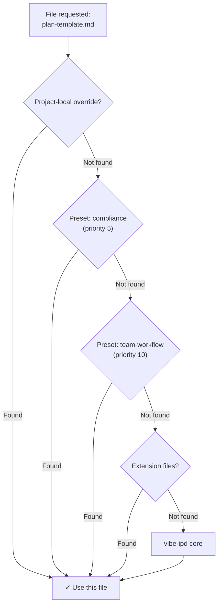

# Presets

Presets customize how vibe-ipd works — overriding templates, commands, and terminology without changing any tooling. They let you enforce organizational standards, adapt the workflow to your methodology, or localize the entire experience. Multiple presets can be stacked with priority ordering.

## Search Available Presets

```bash
specify preset search [query]
```

| Option     | Description          |
| ---------- | -------------------- |
| `--tag`    | Filter by tag        |
| `--author` | Filter by author     |

Searches all active catalogs for presets matching the query. Without a query, lists all available presets.

## Install a Preset

```bash
specify preset add [<preset_id>]
```

| Option           | Description                                              |
| ---------------- | -------------------------------------------------------- |
| `--dev <path>`   | Install from a local directory (for development)         |
| `--from <url>`   | Install from a custom URL instead of the catalog         |
| `--priority <N>` | Resolution priority (default: 10; lower = higher precedence) |

Installs a preset from the catalog, a URL, or a local directory. Preset commands are automatically registered with the currently installed AI coding agent integration.

> **Note:** All preset commands require a project already initialized with `specify init`.

## Remove a Preset

```bash
specify preset remove <preset_id>
```

Removes an installed preset and cleans up its registered commands.

## List Installed Presets

```bash
specify preset list
```

Lists installed presets with their versions, descriptions, template counts, and current status.

## Preset Info

```bash
specify preset info <preset_id>
```

Shows detailed information about an installed or available preset, including its templates, metadata, and tags.

## Resolve a File

```bash
specify preset resolve <name>
```

Shows which file will be used for a given name by tracing the full resolution stack. Useful for debugging when multiple presets provide the same file.

## Enable / Disable a Preset

```bash
specify preset enable <preset_id>
specify preset disable <preset_id>
```

Disable a preset without removing it. Disabled presets are skipped during file resolution but their commands remain registered. Re-enable with `enable`.

## Set Preset Priority

```bash
specify preset set-priority <preset_id> <priority>
```

Changes the resolution priority of an installed preset. Lower numbers take precedence. When multiple presets provide the same file, the one with the lowest priority number wins.

## Catalog Management

Preset catalogs control where `search` and `add` look for presets. Catalogs are checked in priority order (lower number = higher precedence).

### List Catalogs

```bash
specify preset catalog list
```

Shows all active catalogs with their priorities and install permissions.

### Add a Catalog

```bash
specify preset catalog add <url>
```

| Option                                       | Description                                        |
| -------------------------------------------- | -------------------------------------------------- |
| `--name <name>`                              | Required. Unique name for the catalog              |
| `--priority <N>`                             | Priority (default: 10; lower = higher precedence)  |
| `--install-allowed / --no-install-allowed`   | Whether presets can be installed from this catalog (default: discovery only) |
| `--description <text>`                       | Optional description                               |

Adds a catalog to the project's `.specify/preset-catalogs.yml`.

### Remove a Catalog

```bash
specify preset catalog remove <name>
```

Removes a catalog from the project configuration.

### Catalog Resolution Order

Catalogs are resolved in this order (first match wins):

1. **Environment variable** — `SPECKIT_PRESET_CATALOG_URL` overrides all catalogs
2. **Project config** — `.specify/preset-catalogs.yml`
3. **User config** — `~/.specify/preset-catalogs.yml`
4. **Built-in defaults** — official catalog + community catalog

Example `.specify/preset-catalogs.yml`:

```yaml
catalogs:
  - name: "my-org-presets"
    url: "https://example.com/preset-catalog.json"
    priority: 5
    install_allowed: true
    description: "Our approved presets"
```

## File Resolution

Presets can provide command files, template files (like `plan-template.md`), and script files. These are resolved at runtime using a **replace** strategy — the first match in the priority stack wins and is used entirely. Each file is looked up independently, so different files can come from different layers.

> **Note:** Additional composition strategies (`append`, `prepend`, `wrap`) are planned for a future release.

The resolution stack, from highest to lowest precedence:

1. **Project-local overrides** — `.specify/templates/overrides/`
2. **Installed presets** — sorted by priority (lower = checked first)
3. **Installed extensions** — sorted by priority
4. **vibe-ipd core** — `.specify/templates/`

Commands are registered at install time (not resolved through the stack at runtime).

### Resolution Stack



Within each layer, files are organized by type:

| Type      | Subdirectory   | Override path                              |
| --------- | -------------- | ------------------------------------------ |
| Templates | `templates/`   | `.specify/templates/overrides/`            |
| Commands  | `commands/`    | `.specify/templates/overrides/`            |
| Scripts   | `scripts/`     | `.specify/templates/overrides/scripts/`    |

### Resolution in Action



### Example

```bash
specify preset add compliance --priority 5
specify preset add team-workflow --priority 10
```

For any file that both provide, `compliance` wins (priority 5 < 10). For files only one provides, that one is used. For files neither provides, the core default is used.

## FAQ

### Can I use multiple presets at the same time?

Yes. Presets stack by priority — each file is resolved independently from the highest-priority source that provides it. Use `specify preset set-priority` to control the order.

### How do I see which file is actually being used?

Run `specify preset resolve <name>` to trace the resolution stack and see which file wins.

### What's the difference between disabling and removing a preset?

**Disabling** (`specify preset disable`) keeps the preset installed but excludes its files from the resolution stack. Commands the preset registered remain available in your AI coding agent. This is useful for temporarily testing behavior without a preset, or comparing output with and without it. Re-enable anytime with `specify preset enable`.

**Removing** (`specify preset remove`) fully uninstalls the preset — deletes its files, unregisters its commands from your AI coding agent, and removes it from the registry.

### Who maintains presets?

Most presets are independently created and maintained by their respective authors. The vibe-ipd maintainers do not review, audit, endorse, or support preset code. Review a preset's source code before installing and use at your own discretion. For issues with a specific preset, contact its author or file an issue on the preset's repository.
