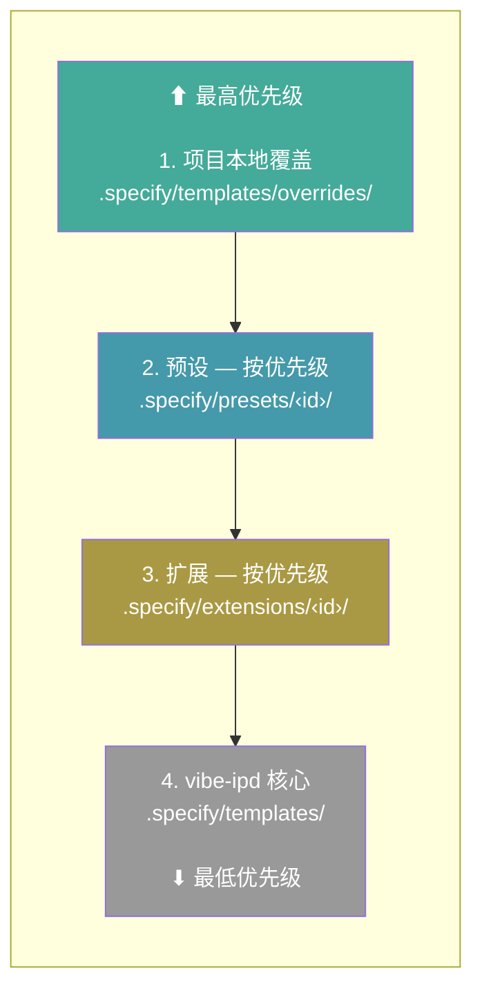
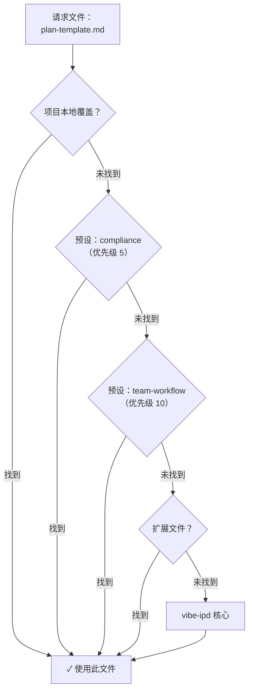

> [English](../../reference/presets.md) · **[中文](.)**

# 预设

预设自定义 vibe-ipd 的工作方式 — 覆盖模板、命令和术语，而无需更改工具本身。它们让你可以强制执行组织标准、使工作流适配你的方法论，或本地化整个体验。多个预设可以按优先级顺序叠加以分层定制。

## 搜索可用预设

```bash
specify preset search [query]
```

| 选项 | 说明 |
| --- | --- |
| `--tag` | 按标签过滤 |
| `--author` | 按作者过滤 |

搜索所有活动目录中与查询匹配的预设。不提供查询时，列出所有可用预设。

## 安装预设

```bash
specify preset add [<preset_id>]
```

| 选项 | 说明 |
| --- | --- |
| `--dev <path>` | 从本地目录安装（用于开发） |
| `--from <url>` | 从自定义 URL 而非目录安装 |
| `--priority <N>` | 解析优先级（默认：10；数值越小优先级越高） |

从目录、URL 或本地目录安装预设。预设命令会自动注册到当前安装的 AI 编码智能体集成。

> **注意：** 所有预设命令需要已使用 `specify init` 初始化的项目。

## 移除预设

```bash
specify preset remove <preset_id>
```

移除已安装的预设并清理其注册的命令。

## 列出已安装预设

```bash
specify preset list
```

列出已安装的预设及其版本、描述、模板数量和当前状态。

## 预设信息

```bash
specify preset info <preset_id>
```

显示已安装或可用预设的详细信息，包括其模板、元数据和标签。

## 解析文件

```bash
specify preset resolve <name>
```

显示给定名称将使用哪个文件，追溯完整的解析堆栈。当多个预设提供同一文件时，这有助于调试。

## 启用/禁用预设

```bash
specify preset enable <preset_id>
specify preset disable <preset_id>
```

禁用预设而不移除它。禁用的预设会在文件解析期间被跳过，但其命令保持已注册状态。使用 `enable` 重新启用。

## 设置预设优先级

```bash
specify preset set-priority <preset_id> <priority>
```

更改已安装预设的解析优先级。数值越小优先级越高。当多个预设提供同一文件时，优先级数值最小的预设获胜。

## 目录管理

预设目录控制 `search` 和 `add` 查找预设的位置。目录按优先级顺序检查（数值越小优先级越高）。

### 列出目录

```bash
specify preset catalog list
```

显示所有活动目录及其优先级和安装权限。

### 添加目录

```bash
specify preset catalog add <url>
```

| 选项 | 说明 |
| --- | --- |
| `--name <name>` | 必填。目录的唯一名称 |
| `--priority <N>` | 优先级（默认：10；数值越小优先级越高） |
| `--install-allowed / --no-install-allowed` | 是否允许从此目录安装预设（默认：仅发现） |
| `--description <text>` | 可选描述 |

将目录添加到项目的 `.specify/preset-catalogs.yml`。

### 移除目录

```bash
specify preset catalog remove <name>
```

从项目配置中移除目录。

### 目录解析顺序

目录按以下顺序解析（优先匹配）：

1. **环境变量** — `SPECKIT_PRESET_CATALOG_URL` 覆盖所有目录
2. **项目配置** — `.specify/preset-catalogs.yml`
3. **用户配置** — `~/.specify/preset-catalogs.yml`
4. **内置默认** — 官方目录 + 社区目录

`.specify/preset-catalogs.yml` 示例：

```yaml
catalogs:
  - name: "my-org-presets"
    url: "https://example.com/preset-catalog.json"
    priority: 5
    install_allowed: true
    description: "我们批准的预设"
```

## 文件解析

预设可以提供命令文件、模板文件（如 `plan-template.md`）和脚本文件。这些文件在运行时使用**替换**策略进行解析 — 优先级堆栈中的首个匹配项胜出并被完全使用。每个文件独立查找，因此不同文件可以来自不同层级。

> **注意：** 其他组合策略（`append`、`prepend`、`wrap`）计划在将来版本中提供。

解析堆栈，从最高到最低优先级：

1. **项目本地覆盖** — `.specify/templates/overrides/`
2. **已安装的预设** — 按优先级排序（数值越小越先检查）
3. **已安装的扩展** — 按优先级排序
4. **vibe-ipd 核心** — `.specify/templates/`

命令在安装时注册（不在运行时通过堆栈解析）。

### 解析堆栈



在每个层级内，文件按类型组织：

| 类型 | 子目录 | 覆盖路径 |
| --- | --- | --- |
| 模板 | `templates/` | `.specify/templates/overrides/` |
| 命令 | `commands/` | `.specify/templates/overrides/` |
| 脚本 | `scripts/` | `.specify/templates/overrides/scripts/` |

### 文件解析示例



### 示例

```bash
specify preset add compliance --priority 5
specify preset add team-workflow --priority 10
```

对于两者都提供的文件，`compliance` 胜出（优先级 5 < 10）。对于仅其中一个提供的文件，使用该文件。对于两者都不提供的文件，使用核心默认值。

## 常见问题

### 能否同时使用多个预设？

可以。预设按优先级堆叠 — 每个文件从提供它的最高优先级源独立解析。使用 `specify preset set-priority` 控制顺序。

### 如何查看实际使用的是哪个文件？

运行 `specify preset resolve <name>` 追溯解析堆栈，查看哪个文件胜出。

### 禁用和移除预设有什么区别？

**禁用**（`specify preset disable`）使预设保持已安装状态，但将其文件排除在解析堆栈之外。预设已注册的命令在你的 AI 编码智能体中仍然可用。这适用于临时测试没有预设时的行为，或比较有/无预设的输出。随时使用 `specify preset enable` 重新启用。

**移除**（`specify preset remove`）完全卸载预设 — 删除其文件、从 AI 编码智能体中注销其命令，并将其从注册表中移除。

### 谁维护预设？

大多数预设由其各自的作者独立创建和维护。vibe-ipd 维护者不审查、审计、认可或支持预设代码。安装前请审查预设的源代码，并自行承担使用风险。有关特定预设的问题，请联系其作者或在预设的仓库中提交问题。
