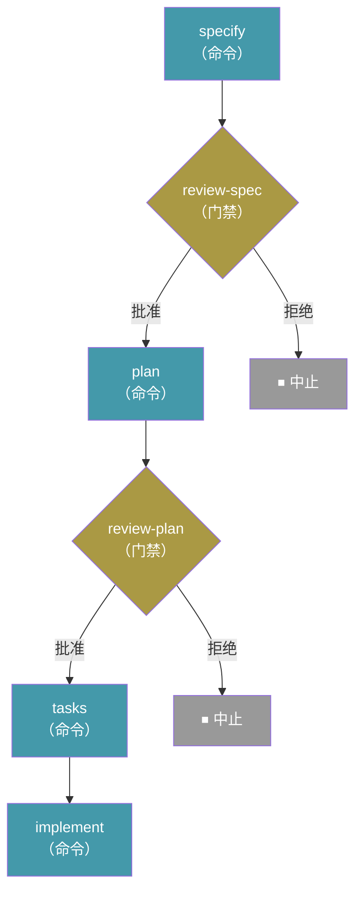

> [English](../../reference/workflows.md) · **[中文](.)**

# 工作流

工作流将多步骤的规范驱动开发过程自动化 — 将命令、提示、Shell 步骤和人工检查点链接成可重复的序列。它们支持条件逻辑、循环、分发/汇聚，并且可以从中断点精确暂停和恢复。

## 运行工作流

```bash
specify workflow run <source>
```

| 选项 | 说明 |
| --- | --- |
| `-i` / `--input` | 以 `key=value` 形式传递输入值（可重复） |
| `--json` | 将运行结果以单个 JSON 对象形式输出 |

从目录 ID、URL 或本地文件路径运行工作流。工作流声明的输入可以通过 `--input` 提供，或以交互方式提示输入。

示例：

```bash
specify workflow run speckit -i spec="Build a kanban board with drag-and-drop task management" -i scope=full
```

使用 `--json` 时，会打印一个机器可读的对象而非格式化文本（省略标志时输出保持不变）：

```bash
specify workflow run my-pipeline.yml --json
```

```json
{
  "run_id": "662bf791",
  "workflow_id": "build-and-review",
  "status": "paused",
  "current_step_id": "review",
  "current_step_index": 0
}
```

`workflow_id` 是 YAML 内部声明的 `workflow.id`，而非文件名。对象按所示格式精确打印 — 双空格缩进、在纯 stdout 上（无 Rich 标记），因此始终可解析。在工作流以 `--json` 运行时，步骤通常打印的任何进度信息（例如门禁提示或提示步骤的 CLI 子进程输出）都会被重定向到 stderr，因此 stdout 仅包含 JSON 对象。从 stdout 读取对象；将 stderr 保留连接到终端或单独捕获。

> **注意：** 大多数工作流命令需要已使用 `specify init` 初始化的项目。例外是 `specify workflow run <local-file.{yml,yaml}>`，它可以在项目外部运行；在这种情况下，运行状态存储在当目录的 `.specify/workflows/runs/<run_id>/` 下。

## 恢复工作流

```bash
specify workflow resume <run_id>
```

| 选项 | 说明 |
| --- | --- |
| `-i` / `--input` | 更新后的输入值，格式为 `key=value`（可重复） |
| `--json` | 将恢复结果以单个 JSON 对象形式输出 |

从暂停或失败的工作流运行的精确步骤处恢复。适用于响应门禁步骤或修复导致失败的缺陷后继续执行。

提供的 `--input` 值会与运行存储的输入合并，并针对工作流的输入类型重新验证，然后使用更新后的值重新运行被阻塞的步骤。这使得运行可以在暂停后利用新获得的信息继续，或在失败后使用更正后的值继续：

```bash
specify workflow resume <run_id> --input cmd="exit 0"
```

## 工作流状态

```bash
specify workflow status [<run_id>]
```

| 选项 | 说明 |
| --- | --- |
| `--json` | 将运行状态（或运行列表）以 JSON 对象形式输出 |

显示特定运行的状态，或未提供 ID 时列出所有运行。运行状态：`created`、`running`、`completed`、`paused`、`failed`、`aborted`。

## 列出已安装工作流

```bash
specify workflow list
```

列出当前项目中安装的工作流。

## 安装工作流

```bash
specify workflow add <source>
```

从目录、URL（需 HTTPS）或本地文件路径安装工作流。

## 移除工作流

```bash
specify workflow remove <workflow_id>
```

从项目中移除已安装的工作流。

## 搜索可用工作流

```bash
specify workflow search [query]
```

| 选项 | 说明 |
| --- | --- |
| `--tag` | 按标签过滤 |

搜索所有活动目录中与查询匹配的工作流。

## 工作流信息

```bash
specify workflow info <workflow_id>
```

显示工作流的详细信息，包括其步骤、输入和要求。

## 目录管理

工作流目录控制 `search` 和 `add` 查找工作流的位置。目录按优先级顺序检查。

### 列出目录

```bash
specify workflow catalog list
```

显示所有活动目录源。

### 添加目录

```bash
specify workflow catalog add <url>
```

| 选项 | 说明 |
| --- | --- |
| `--name <name>` | 目录的可选名称 |

将自定义目录 URL 添加到项目的 `.specify/workflow-catalogs.yml`。

### 移除目录

```bash
specify workflow catalog remove <index>
```

按目录列表中的索引移除目录。

### 目录解析顺序

目录按以下顺序解析（优先匹配）：

1. **环境变量** — `SPECKIT_WORKFLOW_CATALOG_URL` 覆盖所有目录
2. **项目配置** — `.specify/workflow-catalogs.yml`
3. **用户配置** — `~/.specify/workflow-catalogs.yml`
4. **内置默认** — 官方目录 + 社区目录

## 工作流定义

工作流使用 YAML 文件定义。以下是 vibe-ipd 内置的**完整 SDD 周期**工作流：

```yaml
schema_version: "1.0"
workflow:
  id: "speckit"
  name: "Full SDD Cycle"
  version: "1.0.0"
  author: "GitHub"
  description: "Runs specify → plan → tasks → implement with review gates"

requires:
  speckit_version: ">=0.7.2"
  integrations:
    any: ["copilot", "claude", "gemini"]

inputs:
  spec:
    type: string
    required: true
    prompt: "Describe what you want to build"
  integration:
    type: string
    default: "copilot"
    prompt: "Integration to use (e.g. claude, copilot, gemini)"
  scope:
    type: string
    default: "full"
    enum: ["full", "backend-only", "frontend-only"]

steps:
  - id: specify
    command: vipd.specify
    integration: "{{ inputs.integration }}"
    input:
      args: "{{ inputs.spec }}"

  - id: review-spec
    type: gate
    message: "Review the generated spec before planning."
    options: [approve, reject]
    on_reject: abort

  - id: plan
    command: vipd.plan
    integration: "{{ inputs.integration }}"
    input:
      args: "{{ inputs.spec }}"

  - id: review-plan
    type: gate
    message: "Review the plan before generating tasks."
    options: [approve, reject]
    on_reject: abort

  - id: tasks
    command: vipd.tasks
    integration: "{{ inputs.integration }}"
    input:
      args: "{{ inputs.spec }}"

  - id: implement
    command: vipd.implement
    integration: "{{ inputs.integration }}"
    input:
      args: "{{ inputs.spec }}"
```

这会产生以下执行流程：



使用以下命令运行：

```bash
specify workflow run speckit -i spec="Build a kanban board with drag-and-drop task management"
```

## 步骤类型

| 类型 | 用途 |
| --- | --- |
| `command` | 调用 vibe-ipd 命令（例如 `vipd.plan`） |
| `prompt` | 向 AI 编码智能体发送任意提示 |
| `shell` | 执行 Shell 命令并捕获输出 |
| `gate` | 暂停等待人工审批后继续 |
| `if` | 条件分支（then/else） |
| `switch` | 基于表达式的多分支分发 |
| `while` | 条件为真时循环 |
| `do-while` | 至少执行一次，然后根据条件循环 |
| `fan-out` | 为列表中的每个项分发一个步骤 |
| `fan-in` | 聚合 fan-out 步骤的结果 |

## 表达式

步骤可以使用 `{{ expression }}` 语法引用输入和先前步骤的输出：

| 命名空间 | 说明 |
| --- | --- |
| `inputs.spec` | 工作流输入值 |
| `steps.specify.output.file` | 先前步骤的输出 |
| `item` | fan-out 迭代中的当前项 |

可用过滤器：`default`、`join`、`contains`、`map`。

示例：

```yaml
condition: "{{ steps.test.output.exit_code == 0 }}"
args: "{{ inputs.spec }}"
message: "{{ status | default('pending') }}"
```

## 输入类型

| 类型 | 类型转换 |
| --- | --- |
| `string` | 直接传递 |
| `number` | `"42"` → `42`、`"3.14"` → `3.14` |
| `boolean` | `"true"` / `"1"` / `"yes"` → True |

## 状态与恢复

每次工作流运行将其状态持久化到 `.specify/workflows/runs/<run_id>/`：

- `state.json` — 当前运行状态和步骤进度
- `inputs.json` — 已解析的输入值
- `log.jsonl` — 逐步执行日志

这使得 `specify workflow resume` 可以从运行暂停（例如在门禁处）或失败的精确步骤继续执行。

## 常见问题

### 工作流遇到门禁步骤时会发生什么？

工作流暂停并等待人工输入。审核后运行 `specify workflow resume <run_id>` 继续。

### 可以多次运行同一个工作流吗？

可以。每次运行获得唯一的 ID 和独立的状态目录。使用 `specify workflow status` 查看所有运行。

### 谁维护工作流？

大多数工作流由其各自的作者独立创建和维护。vibe-ipd 维护者不审查、审计、认可或支持工作流代码。安装前请审查工作流的源代码，并自行承担使用风险。
