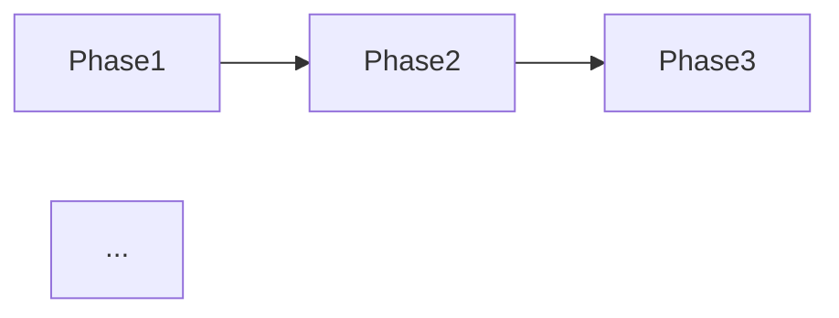

# Contract: Transformation Roadmap Document

**File**: `docs/ipd-transformation/01-transformation-roadmap.md`

**Schema**: The document MUST contain exactly the following sections in order:

```markdown
# IPD Transformation Roadmap

## Overview & Scope

[1–2 paragraph summary of what the transformation entails,
 referencing the current SDD-only state and the target IPD-enhanced state.]

## Phase 1: Foundation

**Entrance Criteria**: [list]
**Exit Criteria**: [list]
**Effort Estimate**: [T-shirt size or weeks]

[Description of Foundation phase work]

### Deliverables
- [deliverable 1]
- [deliverable 2]
...

### Dependencies
- [dependency 1]
- [dependency 2]
...

## Phase 2: Integration

**Entrance Criteria**: [list — must reference Phase 1 exit criteria]
**Exit Criteria**: [list]
**Effort Estimate**: [T-shirt size or weeks]

[Description of Integration phase work]
...

## Phase 3: Optimization

**Entrance Criteria**: [list — must reference Phase 2 exit criteria]
**Exit Criteria**: [list]
**Effort Estimate**: [T-shirt size or weeks]

[Description of Optimization phase work]
...

## Dependency Graph



## Timeline Summary

| Phase | Duration | Effort | Dependencies |
|-------|----------|--------|--------------|
| Foundation | ... | ... | ... |
| Integration | ... | ... | Phase 1 |
| Optimization | ... | ... | Phase 2 |

## Cross-References

- [Command & Template Redesign Guide](02-command-template-redesign-guide.md)
- [Tooling Integration Blueprint](03-tooling-integration-blueprint.md)
- [Role Mapping & PDT Setup Guide](04-role-mapping-pdt-setup-guide.md)
```

**Validation**: Must satisfy FR-001, FR-002, FR-003, and US1 AS3.
