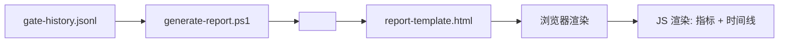

# Data Model: 门控报告编辑风格优化

**日期**: 2026-06-09 | **Feature**: [spec.md](spec.md) | **Research**: [research.md](research.md)

---

## 实体概览

### 1. GateRecord (门控记录)

**来源**: `.specify/memory/gate-history.jsonl`（JSON Lines 格式，每行一条完整 JSON）

**字段**:

| 字段 | 类型 | 必需 | 说明 |
|------|------|------|------|
| `gate` | string | ✅ | 门控阶段标识，如 "TR1"、"TR2_TR3"、"TR4" |
| `status` | string | ✅ | 状态值: "passed" / "failed" / "degraded" |
| `timestamp` | string | ✅ | ISO 8601 时间戳，如 "2026-06-09T10:00:00+08:00" |
| `feature` | string | ✅ | 关联的功能名称，如 "021-report-editorial-redesign" |
| `conditions` | array | ❌ | 检查条件列表，每项含 `criterion`、`matched`、`category` |
| `attempt` | number | ❌ | 当前重试次数，默认 1 |
| `max_attempts` | number | ❌ | 最大重试次数，默认 3 |
| `auto_fix_attempted` | boolean | ❌ | 是否尝试过自动修复，默认 false |
| `evidence` | string | ❌ | 附加证据描述 |

**Condition 子结构**:

| 字段 | 类型 | 必需 | 说明 |
|------|------|------|------|
| `criterion` | string | ✅ | 条件名称，如 "User Story Present" |
| `matched` | boolean | ✅ | 是否通过: true / false |
| `category` | string | ❌ | 分类: "documentation" / "process" / "code" / "security" 等 |

---

### 2. WorkflowMetrics (工作流指标)

**性质**: 派生实体 — 从 GateRecord 集合中动态计算，不持久化存储。

**字段**:

| 字段 | 类型 | 推导方式 | 说明 |
|------|------|----------|------|
| `parallelTasks` | number | 从 TR4/TR4A records 的 conditions 中提取 criterion 含 "Task" 的条件数 | 并行任务数 |
| `agentsSpawned` | number | `Math.round(totalConditions / max(totalRecords, 1))` | 推导的 Agent 估算值 |
| `stagesActive` | number | 每个 gate 取最新 status，计数非 "passed" 的 gate 数 | 当前活跃门阶段 |
| `taskCompletion` | number | `(completedConditions / totalConditions * 100)` 含 Task 标注的条件完成率 | 任务完成百分比 |

---

### 3. GateReport (门控报告)

**性质**: 输出实体 — 生成的静态 HTML 文件。

**字段**:

| 字段 | 类型 | 必需 | 说明 |
|------|------|------|------|
| `path` | string | ✅ | 生成的 HTML 文件路径 |
| `recordCount` | number | ✅ | 注入的门控记录数量 |
| `generatedAt` | string | ✅ | 报告生成时间戳 |

---

## 数据流

1. `generate-report.ps1` 读取 `.specify/memory/gate-history.jsonl`
2. 解析 JSON Lines，可选按 `--gate` 参数过滤
3. 注入 JSON 数据到模板的 `gate-data` script 标签
4. 浏览器打开时，内联 JS 解析 JSON 并渲染编辑风格页面

---

## 验证规则

| 规则 | 说明 |
|------|------|
| JSON 格式 | gate-history.jsonl 每行必须是有效 JSON |
| 空数据处理 | 无记录时显示空状态而非错误 |
| 缺失字段 | 缺少 conditions 时显示"无条件数据" |
| 指标推导失败 | 数据不足时显示"—" |
